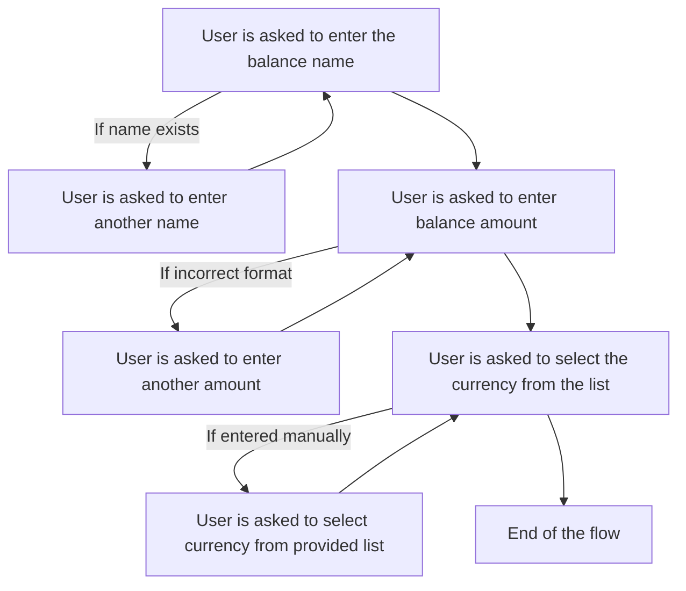
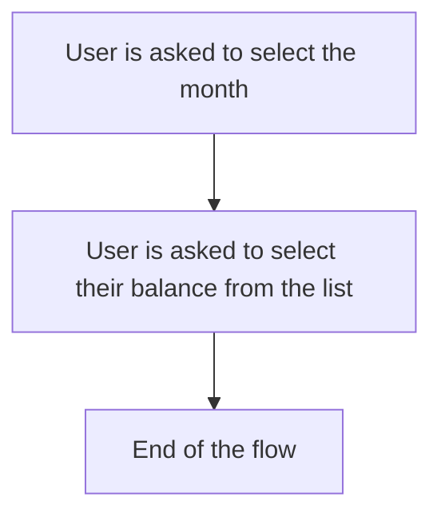
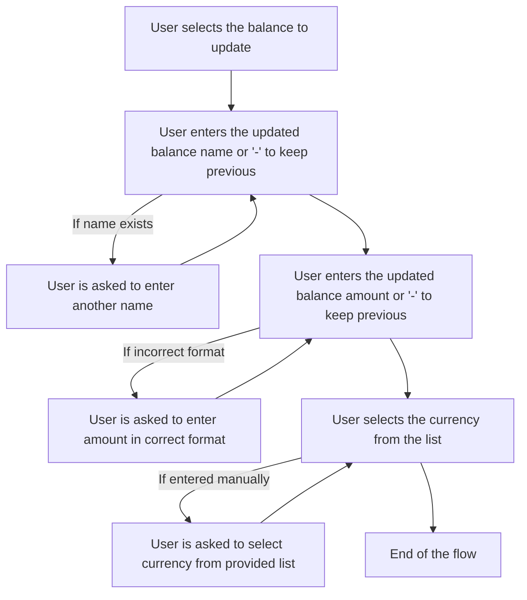
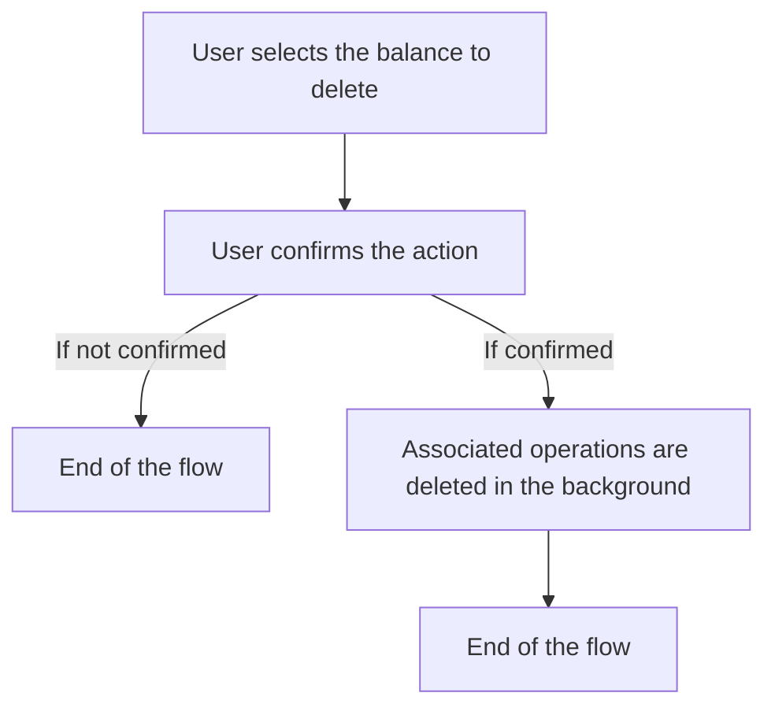

# Balance Operations

### Flow with balances
List of available balance operations:

1. Create a new balance
2. Get balance information
3. Update balance
4. Delete balance

### Create a New Balance

During this flow, the user will be asked to enter the balance name, amount, and select a currency.

### Get Balance Information

During this flow, the user will be asked to select a month and a balance to view its information.

### Update Balance

During this flow, the user will be asked to select a balance and update its details.

### Delete Balance

During this flow, the user will be asked to select a balance and confirm the deletion.

